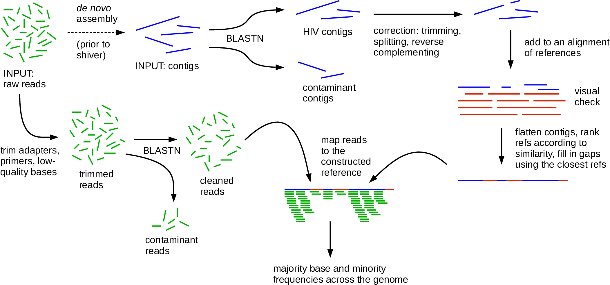

# shiver
Sequences from HIV Easily Reconstructed.
(Works for other viruses too.)

[](http://bioconda.github.io/recipes/shiver/README.html)  

<p align="center"></p>

shiver is a tool for assembling viral genomes by mapping reads (fragments of genetic sequence) to a custom reference sequence constructed using contigs specifc to each sample.
This reduces the biased loss of information that occurs from mapping to a reference that differs from the sample.
From the mapped reads, base frequencies are calculated, and a consensus sequence is called.
The method, its performance and scientific context are discussed [here](https://doi.org/10.1093/ve/vey007); please cite this if you find shiver, or our explanation of the relevant issues, helpful.
If you use shiver, please cite the paper for shiver and the papers of shiver's dependencies: details [here](docs/CitationDetails.bib).

shiver runs natively on Linux and Mac OS, but not Windows.

The easiest way of installing/updating shiver and all its dependencies is through [bioconda](https://bioconda.github.io/recipes/shiver/README.html).
Otherwise, after downloading the code from this repository (e.g. with `git clone https://github.com/ChrisHIV/shiver.git`), manually install all shiver's dependencies: [samtools](http://www.htslib.org/), [biopython](http://biopython.org/wiki/Download), [mafft](http://mafft.cbrc.jp/alignment/software/), [blast](https://blast.ncbi.nlm.nih.gov/Blast.cgi?PAGE_TYPE=BlastDocs&DOC_TYPE=Download) version 2.2.28 or higher (warning: earlier versions of blast have a bug that prevents shiver from correcting contigs), [trimmomatic](http://www.usadellab.org/cms/?page=trimmomatic) (optional: needed if you want to trim reads for quality or adapter sequences), [Fastaq](https://github.com/sanger-pathogens/Fastaq) (optional: needed if you want to trim reads for primers), and at least one of [smalt](http://www.sanger.ac.uk/science/tools/smalt-0) or [BWA](http://bio-bwa.sourceforge.net/) or [bowtie](http://bowtie-bio.sourceforge.net/index.shtml) for mapping.
Installation instructions for all of these are [here](docs/InstallationNotes.sh).  

On any operating system (including Windows), if you have [VirtualBox](https://www.virtualbox.org/wiki/Downloads) installed, you can run [this](https://drive.google.com/file/d/1MohIOgJxcFVRv9v0aG2vyvEVgtm8lcyc/view?usp=sharing) image of Ubuntu Linux 22.04 which contains shiver and our separate tool [phyloscanner](https://github.com/BDI-pathogens/phyloscanner) (which allows you to investigate the within- and between-host diversity in mapped reads produced e.g. by shiver).
Instructions for the image (and full steps for how everything was installed) are [here](https://docs.google.com/document/d/1tX1juaiBhEZ5aW740ME05zaMm480Aj1eFvyY-H3Aor8/edit?usp=sharing).  

The shiver manual is [here](docs/ShiverManual.pdf).

shiver is freely available under the GNU General Public License version 3, described [here](LICENSE).  

### Example 

Say your shiver code lives in `~/shiver`, the `bin` subdirectory has been added to the `$PATH` variable of your command line, and for an alignment of existing reference sequences you've got the 2021 compendium genome alignment for HIV-1 group M including recombinants from [LANL HIV](https://www.hiv.lanl.gov/content/sequence/HIV/mainpage.html), downloaded to `~/Downloads/HIV1_COM_2021_genome_DNA.fasta`.
NB the conda installation of shiver does not include [data/example_input](data/example_input), that's only found here.
A one-off initialisation command, preparing you to process a batch of samples in the same way, is
```
shiver_init.sh my_init_dir ~/shiver/bin/config.sh \
~/Downloads/HIV1_COM_2021_genome_DNA.fasta \
~/shiver/data/example_input/adapters_Illumina.fasta \
~/shiver/data/example_input/primers_GallEtAl2012.fasta
```
In `~/shiver/data/example_input/` is `MysteryHIV_1.fastq` and `MysteryHIV_2.fastq` (simulated paired-end reads) and `MysteryHIV_contigs.fasta` (a toy example of contigs that have already been assembled from those reads).
First we extract from the contigs those that are HIV (i.e. exclude contamination), slice them up if they have structural problems, trim off bits that don't look like HIV, and align them to our set of existing references thus:
```
shiver_align_contigs.sh my_init_dir ~/shiver/bin/config.sh \
~/shiver/data/example_input/MysteryHIV_contigs.fasta my_output_id
```
The resulting `my_output_id_cut_wRefs.fasta` file contains the corrected contigs aligned to the existing references.
Assuming you're happy with that alignment (and as algorithmic alignment of many HIV genomes often goes a bit wrong, even with good algorithms like mafft used here, you might like to inspect the alignment), use it to build a mapping reference tailored for this sample, pre-process the reads, map them and call the consensus thus:
```
shiver_map_reads.sh my_init_dir ~/shiver/bin/config.sh \
~/shiver/data/example_input/MysteryHIV_contigs.fasta my_output_id \
my_output_id.blast my_output_id_cut_wRefs.fasta \
~/shiver/data/example_input/MysteryHIV_1.fastq \
~/shiver/data/example_input/MysteryHIV_2.fastq
```

### Extrapolating from that example to your data

* use the reads, and the contigs assembled from them, for your sequenced sample
* use the adapters and primers relevant for your sequencing protocol
* change options and parameters in the [config file](bin/config.sh) as desired
* choose a (curated) alignment of existing reference sequences relevant for your kind of virus (i.e. HIV or something else) and encompassing all diversity you might find in your set of samples (e.g. for most HIV work this all subtypes and recombinants within HIV-1 group M) 
* read the [manual](docs/ShiverManual.pdf)
