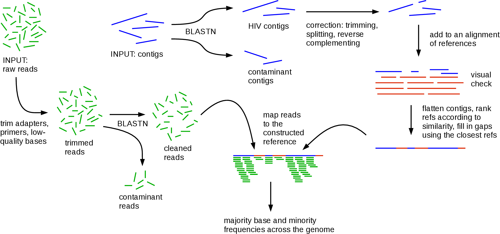

# shiver
Sequences from HIV Easily Reconstructed.  

<p align="center"></p>

Dependencies: [smalt](http://www.sanger.ac.uk/science/tools/smalt-0), [blast](https://blast.ncbi.nlm.nih.gov/Blast.cgi?PAGE_TYPE=BlastDocs&DOC_TYPE=Download), [Fastaq](https://github.com/sanger-pathogens/Fastaq), [trimmomatic](http://www.usadellab.org/cms/?page=trimmomatic) [samtools](http://www.htslib.org/), [biopython](http://biopython.org/wiki/Download), [mafft](http://mafft.cbrc.jp/alignment/software/).  
An alignment of existing reference genomes is required; lots of these are available to download from the [Los Alamos National Lab](http://www.hiv.lanl.gov/content/sequence/NEWALIGN/align.html).

Pipeline parameters can be customised in `config.bash`.  
Before running shiver over a set of samples, you need to run a one-off initialisation step, or the form
```bash
$ ./intialise.bash config.bash MyRefAlignment.fasta MyInitDir
```
This will create a directory `MyInitDir` containing things needed for each sample you process.  
Let's say you have a single sample with forward reads in a file `reads_1.fastq.gz`, reverse reads in a file `reads_1.fastq.gz`, and contigs in a file `contigs.fasta`. Processing that sample is achieved with two commands, with a visual check in between:
```bash
$ ./PerPatientCode_Align.bash MyInitDir contigs.fasta MyOutputID
```


NB all of the file suffixes below (.blast etc.) can be changed from their default values.

Running the aligning step,

Files that definitely will be produced:
SID.blast

Files that might be produced:
SID_hiv.fasta, SID_raw_wRefs.fasta: if there's at least one HIV contig
SID_hiv_cut.fasta, SID_cut_wRefs.fasta: if contig correction was necessary

Running the mapping step,

Files that definitely will be produced:
SID.bam, SID.bam.bai
SID_ref.fasta, SID_ref.fasta.fai
SID_BaseFreqs.csv
SID_InsertSizeCounts.csv

SID_MinCov_foo_bar.fasta, where foo and bar are your chosen thresholds on coverage to call a base at all, and to call a base with upper case, respectively.
SID_ContaminantReads.bam: if there were no contaminant contigs, or if no read pair blasted to the contaminant contigs better than to the tailored reference, the file will still be produced but as a blank file. This is to make it more easy to find the distribution over all your samples of the number of contaminant reads: you just count the number of reads present in each of these files.

Files that might be produced:
SID_clean_1.fastq.gz, SID_clean_2.fastq.gz: if there was at least one contaminant contig and at least one read pair blasted better to it/them than to the tailored reference.
SID_MinCov_foo_bar_ForGlobanAln.fasta, SID_coords.csv: only won't be produced if you manually specify a reference for mapping (instead of constructing one, e.g. if there are no HIV contigs) and you chose one which is not in your input alignment of existing references. Again, foo and bar are your chosen thresholds on coverage.
